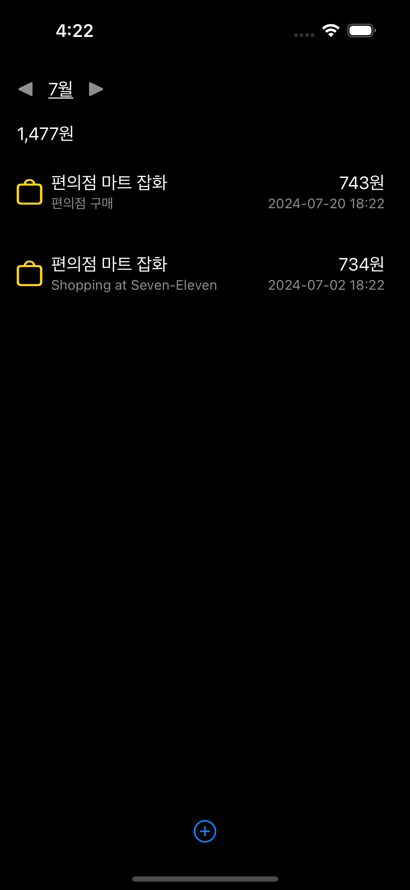

# SmartExpenceTracker
## Tracking Expense using AI
Chat GPT를 이용한 영수증을 분석 및 저장하는 앱입니다

## Preview
<div align="center">
  
</div>

## GPT API Key 발급받기
다음 GPT 요약 서비스를 이용하기 위해서는 링크를 통해 API Key를 발급받아줍니다. https://platform.openai.com/account/api-keys

#### API Key 추가
발급받은 API Key를 추가한다면 다음과 같이 API를 사용할 수 있는 인스턴스를 생성줍니다.

```swift
var openAI = OpenAI(apiToken: "발급받은 API KEY")
```


## 사용한 GPT 패키지
https://github.com/MacPaw/OpenAI 을 가지고 SPM을 추가해줍니다.
```
https://github.com/MacPaw/OpenAI
```

## GPT로 영수증 분석하기

분석하기 위해서는 Chat GPT API에서 사용될 tool을 만들어줘야 합니다.
아래에서 만든 tool은 api에 요청할 메서드에 파라미터로 입력되어 원하는 동작을 gpt가 하도록 지정할 수 있습니다.
```swift
let tools: [ChatQuery.ChatCompletionToolParam] = [
    ChatQuery.ChatCompletionToolParam(function: .init(
        name: AIAssistantFunctionType.addExpenseLog.rawValue,
        description: "Analyze this Reciepts by given image, and object and prices have to be value of marchant",
        parameters:
                .init(
                    type: .object,
                    properties:
                        [
                        "title": titleProm,
                        "amount": amountProm,
                        "category": categoryProm,
                        "date": dateProm,
                    ],
                    required: ["title", "amount", "category", "date"]
                )
        )
     ),
    ChatQuery.ChatCompletionToolParam(function: .init(
        name: AIAssistantFunctionType.listExpenses.rawValue,
        description: "Analyze this Reciepts and give me each merchandise info by given image",
        parameters:
                .init(
                    type: .object,
                    properties: [
                        "object": objectProm,
                        "price": priceProm,
                    ],
                    required: ["object", "price"]
                )
        )
     )
]
```

## SwiftData API를 사용하여 데이터를 저장합니다

```swift
@Model
class RecordReceipts: Codable, Identifiable {
    var id: UUID = UUID()
    var title: String = ""
    var amount: Int = 0
    var category: Category = Category.none
    var date: String = ""
    var memo: String = ""
    var marchant: [Marchandize]
}
```


## 분석하는 레이어 UI
```swift
Rectangle()
    .fill(Color.green)
    .frame(width: 400, height: 5)
    .opacity(isOpacity ? 0.3 : 0.8)
    .offset(y: isOffset ? -20 : UIScreen.main.bounds.height - 100)
    .overlay(
        Rectangle()
            .fill(Color.green)
            .frame(width: 400, height: 50)
            .opacity(isOpacity ? 0.3 : 0.8)
            .offset(y: isOffset ? 0 : UIScreen.main.bounds.height - 120)
    )
    .onAppear {
        withAnimation(Animation.easeInOut(duration: 1).repeatForever(autoreverses: true)) {
            isOpacity.toggle()
        }
        withAnimation(Animation.easeInOut(duration: 3).repeatForever(autoreverses: true)) {
            isOffset.toggle()
        }
    }
```

## 월 기준으로 정리되는 데이터
영수증은 월 단위로 확인할 수 있으며 해당 월에 얼만큼 사용하였는지 전체 금액의 합을 상단에 나타냅니다.

<div align="center">
  
</div>

### 상단 총액 구하는 코드

```swift
private var balanceSection: some View {
    let totalAmount = listReceipts
        .filter { receipt in
            let receiptYearMonth = receipt.date.description.prefix(7)
            let currentYearMonth = currentDate.description.prefix(7)
            return receiptYearMonth == currentYearMonth
        }
        .reduce(0) { $0 + $1.amount }
    
    return HStack {
        Text("\(totalAmount)원")
            .padding(.horizontal)
        Spacer()
    }
}
```
